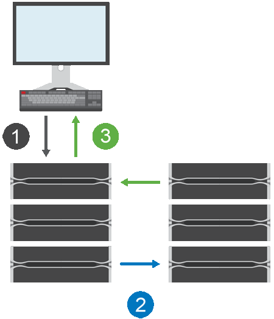

= 동기 미러링의 작동 방식
:allow-uri-read: 
:icons: font
:imagesdir: ../media/

[role="lead"]
동기식 미러링은 데이터 볼륨을 실시간으로 복제하여 지속적인 가용성을 보장합니다.

[NOTE]
====
EF600 또는 EF300 스토리지 어레이에서는 미러링을 사용할 수 없습니다.

====
동기식 미러링은 두 스토리지 어레이 중 하나에서 재해가 발생할 경우 중요한 데이터의 복사본을 사용할 수 있으므로 손실된 데이터가 없는 복구 지점 목표(RPO)를 실현합니다. 복제본은 운영 볼륨에 쓸 때마다 보조 볼륨에 쓰기가 수행되므로 항상 운영 데이터와 동일합니다. 보조 볼륨이 운영 볼륨에서 수행된 변경 사항으로 성공적으로 업데이트될 때까지 호스트는 쓰기가 성공했다는 확인 메시지를 받지 않습니다.

이러한 유형의 미러링은 재해 복구와 같은 비즈니스 연속성 목적으로 이상적입니다.

== 동기 미러링 관계

동기식 미러링 관계는 운영 볼륨과 별도의 스토리지 어레이의 보조 볼륨으로 구성됩니다. 운영 볼륨이 포함된 스토리지 배열은 대개 운영 사이트에 있으며 활성 호스트를 제공합니다. 보조 볼륨이 포함된 스토리지 배열은 일반적으로 보조 사이트에 있으며 데이터 복제본을 보관합니다. 보조 볼륨은 완전한 정전, 화재 또는 운영 사이트의 하드웨어 장애 등으로 인해 운영 볼륨의 스토리지 어레이를 사용할 수 없는 경우에 사용됩니다.

== 동기 미러링 세션

동기 미러링 구성 프로세스에는 볼륨을 쌍으로 구성하는 작업이 포함됩니다. 한 스토리지 어레이의 운영 볼륨과 다른 스토리지 어레이의 보조 볼륨으로 구성된 미러링된 쌍을 생성한 후 동기식 미러링을 시작할 수 있습니다. 다음은 동기 미러링의 단계입니다.

. 쓰기가 호스트에서 제공됩니다.
. 쓰기가 운영 볼륨에 커밋되고 원격 시스템으로 전파된 다음 보조 볼륨으로 커밋됩니다.
. 운영 볼륨의 스토리지 배열은 두 쓰기 작업이 성공적으로 완료된 후 호스트 시스템 _after_에 입출력 완료 메시지를 보냅니다.

예약된 용량은 호스트에서 들어오는 쓰기 요청에 대한 정보를 기록하는 데 사용됩니다.

운영 볼륨의 현재 컨트롤러 소유자가 호스트로부터 쓰기 요청을 받으면 컨트롤러는 먼저 운영 볼륨의 예약 용량에 대한 쓰기 정보를 기록합니다. 그런 다음 데이터를 운영 볼륨에 씁니다. 그런 다음 컨트롤러는 원격 쓰기 작업을 시작하여 영향을 받는 데이터 블록을 원격 스토리지 배열의 보조 볼륨으로 복사합니다.

호스트 애플리케이션은 로컬 스토리지 어레이와 원격 스토리지 어레이의 네트워크에서 쓰기가 수행되기를 기다려야 하므로 로컬 입출력 성능을 지나치게 낮추지 않고 미러 관계를 유지하려면 로컬 스토리지 시스템과 원격 스토리지 시스템 간에 매우 빠른 연결이 필요합니다.

== 재해 복구

동기식 미러링은 데이터가 상주하는 사이트와 물리적으로 멀리 있는 데이터의 복사본을 유지 관리합니다. 운영 사이트에서 정전 또는 홍수 같은 재해가 발생할 경우 보조 사이트에서 데이터에 빠르게 액세스할 수 있습니다.

동기식 미러링 작업이 진행 중인 동안에는 보조 볼륨을 호스트 애플리케이션에 사용할 수 없으므로 로컬 스토리지 어레이에 재해가 발생할 경우 원격 스토리지 시스템으로 페일오버할 수 있습니다. 페일오버하려면 보조 볼륨을 운영 역할로 상향 이동합니다. 그런 다음 복구 호스트가 새로 상향 이동된 볼륨에 액세스할 수 있고 비즈니스 작업을 계속할 수 있습니다.

== 동기화 설정

미러링된 페어를 생성할 때 통신 중단 후 미러링된 페어가 재동기화 작업을 완료하는 데 사용하는 동기화 우선 순위 및 재동기화 정책도 정의합니다.

두 스토리지 시스템 간의 통신 링크가 작동하지 않는 경우 호스트는 로컬 스토리지 어레이로부터 승인을 계속 받아 액세스 손실을 방지합니다. 통신 링크가 다시 작동 중일 때 복제되지 않은 모든 데이터는 원격 스토리지 시스템에 자동으로 또는 수동으로 다시 동기화될 수 있습니다.

데이터가 자동으로 재동기화되는지 여부는 미러링된 페어의 재동기화 정책에 따라 달라집니다. 자동 재동기화 정책을 사용하면 링크가 다시 작동할 때 미러링된 쌍이 자동으로 재동기화됩니다. 수동 재동기화 정책을 사용하려면 통신 문제가 발생한 후 수동으로 동기화를 다시 시작해야 합니다. 수동 재동기화는 권장 정책입니다.

운영 볼륨이 포함된 스토리지 어레이에서만 미러링된 쌍의 동기화 설정을 편집할 수 있습니다.

== 동기화되지 않은 데이터

운영 볼륨의 스토리지 시스템이 보조 볼륨에 데이터를 쓸 수 없을 경우 운영 볼륨과 2차 볼륨의 동기화가 해제됩니다. 이 문제는 다음과 같은 문제로 인해 발생할 수 있습니다.

* 로컬 스토리지와 원격 스토리지 시스템 간의 네트워크 문제입니다
* 장애가 발생한 보조 볼륨입니다
* 동기화가 미러링된 쌍에서 수동으로 일시 중단됩니다

== 분리된 미러링 쌍

구성원 볼륨이 한 쪽(기본 측 또는 보조 측)에서 제거되었지만 다른 쪽에는 제거되지 않은 경우 분리된 미러링된 쌍 볼륨이 존재합니다.

스토리지 간 통신이 복구되고 미러 구성의 양측이 미러 매개 변수를 조정할 때 분리된 미러링된 쌍 볼륨이 감지됩니다.

미러링된 쌍을 제거하여 분리된 미러 쌍 상태를 수정할 수 있습니다.

== 구성 및 관리

두 어레이 간에 미러링을 설정하고 구성하려면 Unified Manager 인터페이스를 사용해야 합니다. 미러링이 활성화되면 System Manager에서 미러링된 쌍과 동기화 설정을 관리할 수 있습니다.
