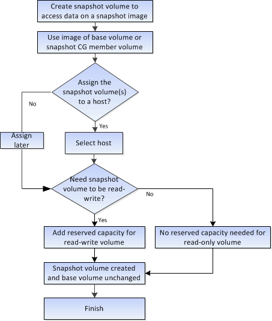

= 스냅샷 이미지 및 스냅샷 볼륨 생성 워크플로우
:allow-uri-read: 
:icons: font
:imagesdir: ../media/

[role="lead"]
System Manager에서 다음 단계를 수행하여 스냅샷 이미지와 스냅샷 볼륨을 생성할 수 있습니다.

== 스냅샷 이미지 생성 워크플로

image::../media/sam1130-flw-snapshots-create-ss-images.gif[sam1130 Flw 스냅샷은 ss 이미지를 생성합니다]

== 스냅샷 볼륨 생성 워크플로우입니다

